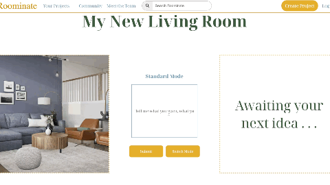
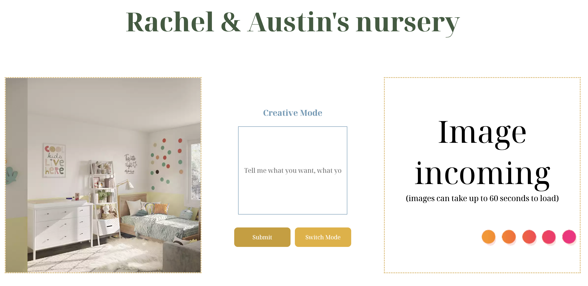
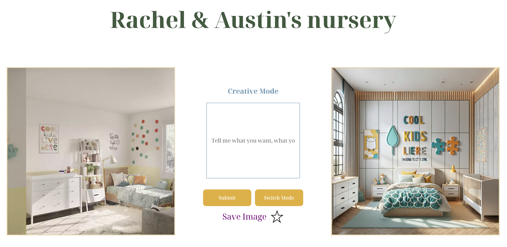
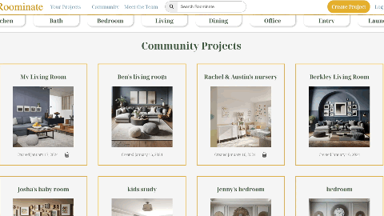

# Roominate

[Join the Roominate community!](https://roominate.onrender.com/)

### Basic Overview

Roominate is a tool to help you design your home. Select/upload a photo of the area you'd like to upgrade, and either draw creative inspiration or dictate specific upgrades and changes you already have in mind for your space. Build your portfolio of projects, share with the community, see what other's are working on, comment and share your ideas and thoughts!

  

### Tech Stack
This app uses the following open-source packages:

 - [Dall-E 3](https://rubyonrails.org/) openAI API to render photos in our Creative Mode
 - [Dall-E 2](https://aws.amazon.com/) openAI API to render photos in our Standard Mode
 - [Express](https://expressjs.com/) back end web application framework for building RESTful APIs with Node.js
 - [MongoDB](https://rubyonrails.org/) NoSQL database
 - [AWS S3](https://aws.amazon.com/) to store and render every photo in this app
 - [Render](https://render.com/) to host this app online
 - [React](https://react.dev/) frontend JS library
 - [Redux](https://redux.js.org/) for managing and centralizing application state
 - [Mongoose](https://render.com/) to host this app online
 - [FontAwesome](https://fontawesome.com/) for icons used on Roominate
 - [Node](https://nodejs.org/en)


### Components
A few challenging features to integrate into our app were saving images, creating a searchbar, adding comments, and backend routing with AWS S3,
Here's how we solved these issues:

1. Saving Images - Upon recieving a new image you can choose to save it. You should only see the `save` option when a new photo is loaded. Also, you should only be able to see the `done` button when you have saved at least one photo. These buttons are conditionally rendered by manipulating the photoCount and state in different parts of the code. We are also condtionally rendering each display/loading message  and image based on which process you're currently in while creating your project.

` const handleSavingImage = () => {
        if (!newImages) return
        setPhotoCount(photoCount + 1)

        dispatch(addImage(projectId, {url: newImages.imageGenerated})).finally(() => {
          dispatch(removeImage())
          setPhotoCount(count)
          setTempDisplay(true)
          setImageLoading(false)
        })
    }

    const savingImage = () => {
      if (photoUrls.length === photoCount) {
        return (
          <label className='text save-img'> Save Image
          <svg
            className="star-icon"
            width="20"
            height="24"
            viewBox="0 0 24 24"
            fill={starFilled ? 'gold' : 'none'}
            onMouseEnter={() => handleStarHover(!starFilled)}
            onClick={() => handleSavingImage()}
            >
            <path d="M12 2l2.591 7.82H22l-6.711 4.872 2.591 7.82L12 17.64l-6.879 4.872 2.591-7.82L2 9.82h7.409L12 2z"/>
          </svg>
        </label>
        )
      } else {
        return (
           <div className='text'>Saving
              
           </div>

        )
      }
    }

    const handleSubmit = async (e) => {
        e.preventDefault();
        setPhotoCount(count);
        setTempDisplay(true)
        setImageLoading(true)
        dispatch(removeImage())
    `
  
  


2. Backend Routes - Node and Express were used for Roominate's backend, and some routes were more challenging to create than others. Our Project
creation route required integration with AWS S3:

```
router.post('/', upload.single('photo'), async (req, res, next) => {

  const imageName = randomImageName();

  const newProject = new Project({
    title: req.body.title,
    description: req.body.description,
    photoUrls: req.body.photoUrls,
    public: req.body.public,
    author: req.body.authorId
  });

  newProject.photoUrls=[`https://dalle-interior-design-dev.s3.us-west-1.amazonaws.com/${imageName}`]

  const params = {
    Bucket: awsBucketName,
    Key: imageName,
    Body: req.file.buffer,
    ContentType: req.file.mimetype
  }

  try{
    newProject.author = await User.findById(req.body.authorId);
  }catch(err) {
    const error = new Error(err);
    error.statusCode = 404;
    error.errors = { message: "No user found with that id" };
    return next(error);
  }try {
    const command = new PutObjectCommand(params);
    const uploadedPhoto = await s3.send(command);
    let project = await newProject.save();
    project = await project.populate('author', '_id');
    return res.json(project);
  }catch(err) {
    const error = new Error(err);
    error.statusCode = 422;
    return next(error);
  }
})
```

## Highlights

1. Search Bar - We implemented a search bar where you can choose to either search for a project in the search bar or utilize the premade search bar to find designs you are interested in.

  

2. Comments - App your comments to any public project to view what others think!

  


## Future Features!
- Suggested Shopping - See an item in a photo that you'd like to buy? We plan to incorporate a feature that will link you to where you can purchase a similar product

- Faster Page Loading - To enhance page loading speed, we intend to display a limited set of project images on the community page instead of rendering all projects at once. By incorporating separate pages for scrolling through projects, we aim to optimize user experience and alleviate the strain on the system, particularly as our user base expands.

- Searching for users - Our search bar currently only can view public projects. We would like to implement a search component to find other users whose page you want to view.
